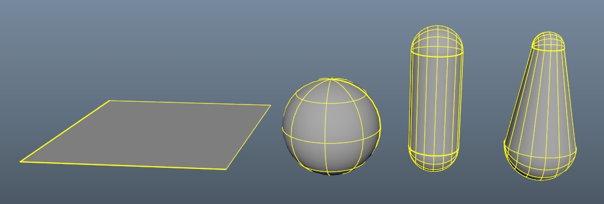

# Overview
Create collision detection using expression node.

It is created only with expression node of Maya standard function. No plug-in node or other installation is required.

**Tested with :**
* Maya 2024 (Python3.10.8)  
* Maya 2023 (Python3.9.7)  
* Maya 2022 (Python3.7.7)  
* Maya 2020 (Python2.7.11)  
* Maya 2019 and below are not supported

**Example of capsule collider :**
  

# Supported colliders
  
* Infinite Plane
* Sphere
* Capsule
* Capsule2 (radius individually)

# Installation
Please do one of the following:
* Copy the expCol directory into the `C:\Users\<username>\Documents\maya\scripts`.
* Add the parent directory of expCol to PYTHONPATH environment variable.
* Add the parent directory of expCol to PYTHONPATH in Maya.env.

# Usage
## Create Collider
```python
from expCol import collider

collider.iplane()   # Infinite Plane
collider.sphere()   # Sphere
collider.capsule()  # Capsule
collider.capsule2() # Capsule2 (radius individually)
```

## Create Detection
```python
from expCol import detection

detection.create(
    'parent', 
    'input', 
    'output', 
    'controller', 
    colliders=collider_list, 
    groundCol=True, 
    scalable=False,
    radius_rate=None,
)
```
* `parent` (str): Parent 'transform' or 'joint'.  
* `input` (str): Child 'transform' or 'joint' before correction.  
* `output` (str): Child 'transform' or 'joint' after correction.   
* `controller` (str): Any node to add attributes for control.  
* `colliders` (list, optional): List of collider names. Defaults to [].
* `groundCol` (bool, optional): Add horizontal plane collision. Defaults to False.
* `scalable` (bool, optional): Allow for parent scale of joint-chain and parent scale of colliders. Defaults to False.
* `radius_rate` (float, optional): Rate at which radius and tip radius are interpolated, between 0 and 1. Defaults to None.  

> **Note**  
> For more information on `parent`, `input` and `output`, please click [here](explanation_of_parent_input_output.md).  

If you just want to add an attribute to a controller, do the following. It is also called in `detection.create`.  
```python
detection.add_control_attr(
    'controller', 
    groundCol=True, 
    tip_radius=True
)
```

## Example
```python
from maya import cmds
from expCol import collider, detection

# Create sample joint chain
rootCtl = cmds.createNode('transform', n='rootCtl')
jointList = []
for i in range(5):
    jointList.append(cmds.joint(n='joint_{}'.format(i), p=[i*3,0,0]))
cmds.setAttr(rootCtl+'.ty', 5)

for i in range(len(jointList)-1):
    p = cmds.listRelatives(jointList[i], p=True)[0]
    pos1 = cmds.xform(jointList[i], q=True, ws=True, t=True)
    pos2 = cmds.xform(jointList[i+1], q=True, ws=True, t=True)
    prt = cmds.createNode('transform', n='parent_{}'.format(i), p=p)
    ipt = cmds.createNode('transform', n='input_{}'.format(i), p=p)
    out = cmds.createNode('transform', n='output_{}'.format(i), p=p)
    cmds.xform(prt, ws=True, t=pos1)
    cmds.xform(ipt, ws=True, t=pos2)
    cmds.xform(out, ws=True, t=pos2)
    cmds.aimConstraint(out, jointList[i], u=[0,0,1], wu=[0,0,1], wut='objectrotation', wuo=prt)

# Create Colliders
collider_list = []
collider_list.append(collider.iplane())
collider_list.append(collider.capsule())

# Create Detections
for i in range(len(jointList)-1):
    detection.create(
        'parent_{}'.format(i), 
        'input_{}'.format(i), 
        'output_{}'.format(i), 
        'rootCtl', 
        colliders=collider_list, 
        groundCol=True, 
        scalable=True,
        radius_rate=float(i)/float(len(jointList)-2)
    )
```

### `groundCol` option
Setting groundCol to True adds an invisible horizontal collision. The height can be changed with the GroundHeight value.  


### `scalable` option
If scalable is set to True, the scale of the parent of the joint-chain or the parent of the collider is reflected.  
|scalable=True|scalable=False|
|---|---|
|||

### `radius_rate` option
Interpolate radius and tip_radius by the radius_rate value. 0.0 matches radius and 1.0 matches tip_radius.  


# Note
* A high `Colision Iteration` value increases the accuracy of collision detection, but it also increases the processing load.
* A large number of detections can be very heavy.
* The number of colliders cannot be changed after a detection (expression node) is created.
